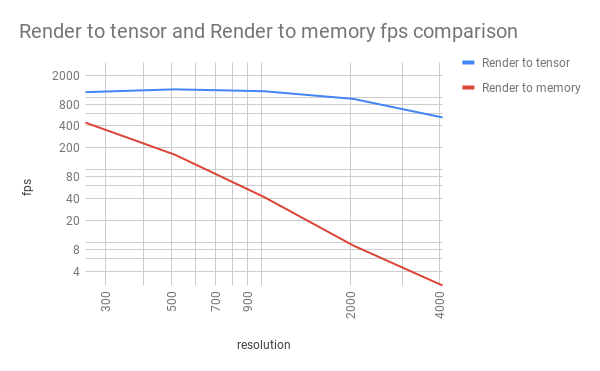

# YCB Renderer

This is an PyOpenGL version of YCB renderer, it has some key features to work 
with deep learning frameworks. This renderer is created by Fei Xia (feixia@stanford.edu) and modified by Yu Xiang 
(yux@nvidia.com) and Xinke Deng (xdeng12@illinois.edu).
- EGL headless rendering, so a running x server is not required
- Rendering to multiple texture buffers, so it can render rgb, segmentation,
point cloud in a single shader call
- Uses OpenGL - CUDA interoperation to render to pytorch tensor directly.
- Support `eglQueryDevicesEXT` and `eglGetPlatformDisplayEXT` via `pybind11`. So it
is easy to choose which GPU to use.
- Minimalistic, it uses raw OpenGL, doesn't rely on third-party GL helper libraries other than 
`assimp`. 

Install dependencies:

```bash
sudo apt-get install libassimp-dev
pip install -r requirement.txt
#additionally, you need to install nvidia OpenGL drivers and make them visible
export LD_LIBRARY_PATH=/usr/lib/nvidia-<vvv>:$LD_LIBRARY_PATH
```


In a virtual environment, run `python setup.py develop` should compile c++ sources
and setup paths. 

### optional
If you want to render to tensor, you need to install [pytorch](https://pytorch.org).

## Example
`python ycb_renderer.py <YCB model path>`, use 'aswd' to control, 'q' to quit. It renders
512x512 images at 162 fps. 

Render to pytorch tensor example: `python ycb_renderer_tensor.py <YCB model path>`, it
is able to render 1024x1024 images at 1300 fps.

Rendering speed comparison:

